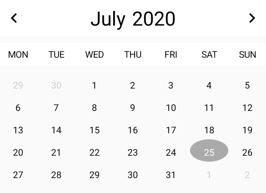

# **JDCalendar**

[](https://github.com/i-on-project/android/blob/master/LICENSE)
[](https://jitpack.io/#i-on-project/android-calendar)
[](https://github.com/i-on-project/android/tags)
[](https://github.com/i-on-project/android/commits/master)
[](https://github.com/i-on-project/android/pulls/)
[](https://github.com/i-on-project/android/issues/)
[](https://github.com/i-on-project/android/graphs/contributors/)

JDCalendar is an open-source fully customizable calendar component for the Android framework.

## Benefits
- Colors and text sizes are all customizable
- Its functionalities can be easily extended to support your app requirements
- Uses coroutines to offload operations which required heavier processing from the main thread to a background thread
- Its methods are framework alike

## Default Implementation

By default the calendar presents the days and allows navigation between months. The figure below shows the default colors and sizes used for the calendar.

<div align="center">
    
</div>

## Using the calendar
To use JDCalendar you first have to add the following dependencies to graddle.

In project/build.graddle:

```gradle
allprojects {
    repositories {
        ...
        maven { url 'https://jitpack.io' }
    }
}
```

In your app module build.graddle:
```gradle
dependencies {
    implementation 'com.github.i-on-project:android-calendar:1.0.0'
}
```

Then in your activity or fragment layout you have to include the following tag:

```XML
<org.ionproject.jdcalendar.JDCalendar
        android:id="@+id/jdcalendar_activity_main"
        android:layout_width="wrap_content"
        android:layout_height="wrap_content"/>
```

Finally in the ```onDestroy()``` callback of your activity or ```onDestroyView()``` of your fragments you **MUST** call ```destroy()``` like so:

**For activities:**

```Kotlin
override fun onDestroy() {
    super.onDestroy()
    jdcalendar_activity_main.destroy()
}
```

**For fragments**
```Kotlin
override fun onDestroyView() {
    super.onDestroyView()
    jdcalendar_activity_main.destroy()
}
```

This will ensure that all the coroutines launched by consequence of navigating through the calendar are cancelled.

## Customizing the calendar

### Customizable attributes

The JDCalendar component contains a list of attributes which can change the color and text sizes of elements in the calendar. This attributes can be set either from the layout or programmatically throught properties.

Example:

```XML
<org.ionproject.jdcalendar.JDCalendar
        android:id="@+id/jdcalendar_calendar"
        android:layout_width="match_parent"
        android:layout_height="wrap_content"
        custom:monthTextColor="#ffffff"
        custom:nextButtonColor="#ffffff"
        custom:prevButtonColor="#ffffff"
        custom:topSectionBackgroundColor="#9e2514"
        custom:yearTextColor="#ffffff" />
```


Customizable attributes list, in between parentheses are the formats of the attributes:

- topSectionBackgroundColor (color) - the background color of the section which contains the previous/next arrows, the month and the year
- weekDaysHeaderBackgroundColor (color) - the background color of the section which contains the short name (e.g MON) of the days of the week
- monthDaysGridBackgroundColor (color) - the background color of the grid containing the days of the month
- nextButtonColor (color) - the color of right the arrow 
- prevButtonColor (color) - the color of the left arrow
- monthTextColor (color) - the color of the month text
- yearTextColor (color) - the color of the year text
- weekDaysTextColor (color) - the color of the short name of a day of week (e.g MON)
- monthTextSize (dimension) - the size of the month text
- yearTextSize (dimension) - the size of the year text
- weekDaysTextSize (dimension) - the size of the short name of a day of week (e.g MON)

### Custom adapter

Internally, the JDCalendar uses an adapter to inflate the views that represent the days of the month. This adapter can be customized to fit your app needs. Similarly to the RecyclerView component the JDCalendar exposes a property, ```adapter```, which can be set with a custom implementation of the ```CalendarAdapter``` abstract class. This class contains a set of methods that control the instantiation and binding of the views within the days grid.

Example implementation:
```Kotlin
class MyCalendarAdapter() : CalendarAdapter<MyCalendarAdapter.MyViewHolder>() {

    // Creates the ViewHolder
    override fun onCreateViewHolder(parent: ViewGroup): MyViewHolder {
        val view = LayoutInflater.from(parent.context).inflate(R.layout.grid_item_jdcalendar, parent, false)
        return MyViewHolder(view)
    }

    // Binds the ViewHolder to the day of the month
    override fun onBindViewHolder(viewHolder: MyViewHolder, day: Day, position: Int) {
        viewHolder.bind(day)
    }

    class MyViewHolder(
        view: View
    ) : ViewHolder(view) {

        // Contains the text of the day (e.g 1,2..)
        private val dayTextView =
            view.textview_list_item_calendar_day 

        fun bind(day: Day) {
            view.setBackgroundResource(0) // Cleans background resource
            var textColor = Color.BLACK // Default text color

            // If the day is today update the text color and background
            if (day.isToday) { 
                textColor = Color.WHITE
                view.setBackgroundResource(R.drawable.shape_circle_30dp)
            } else if (!day.isDayOfCurrMonth) {
                // If the day is not from this month update the text color
                textColor = Color.LTGRAY
            }

            dayTextView.setTextColor(textColor)
            dayTextView.text = "${day.value.day}"
        }
    }
}
```

To implement a custom adapter you first have to extend the abtract class ```CalendarAdapter``` and implement the following methods:

- ```onCreateViewHolder(parent: ViewGroup)```: this method must inflate the View from the ViewGroup, place it inside a ViewHolder and return it. The View can be inflated from any layout, which allows for a lot of customizability. This method will be called only once for each day in the calendar when its being created, or when the number of days in the grid increases.

- ```onBindViewHolder(viewHolder: VH, day: Day, position: Int)```: this method must bind the viewHolder to the ```Day``` object passed as parameter. Here you should contain all the logic regarding the displaying of the day of the month. The day object contains information about the current day being displayed in the calendar. Here you can bind the day however you want, for example you can go to your ViewModel, check if this day has any events and bind them to the ViewHolder. This method will be called for each day of the calendar when the calendar is first created and everytime the month is changed.

You also have to create a class that extends the ```ViewHolder``` abstract class which is a container of a view used inside the calendar grid. In the example above the ViewHolder contains a single method which transfers the current day value from the ```Day``` object to the TextView.

To associate the example ```MyCalendarAdapter``` with JDCalendar all you have to to is:

```Kotlin
jdcalendar_activity_main.adapter = MyCalendarAdapter()
```

This code can be placed in ```onCreate()``` or ```onViewCreated()``` for activities or fragments respectively.

**IMPORTANT NOTE:** Just like in the RecyclerView component, the ViewHolders are re-used, this avoids having to inflate views everytime the user navigates to the next month in the calendar. Because of this, in the ```onBindViewHolder()``` method, you cannot forget to reset the view contained in the ViewHolder to its inicial state.  If you notice, in the example implementation, at the beginning of the method bind inside the ViewHolder, the background is always cleaned, and the text set to black. If we didn't do this, the view would maintain its previous colors.

If you want to check a more complex use of the JDCalendar, with events, check the source code of the [i-on Android application](https://github.com/i-on-project/android). 


